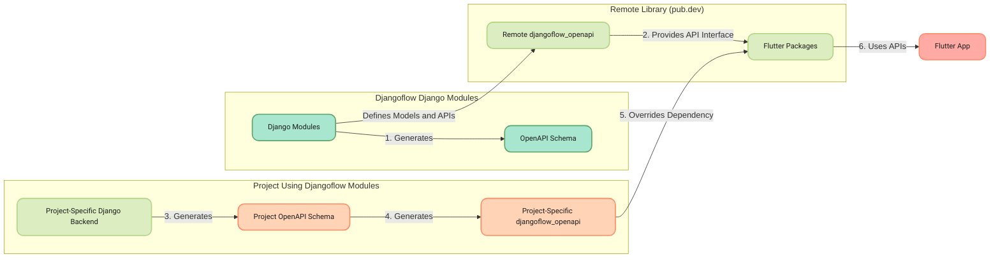

## Architectural Overview of `djangoflow_openapi`

`djangoflow_openapi` is a Dart package that serves as a bridge between Django backend modules and Flutter frontend applications. It provides a consistent API interface, allowing developers to interact with backend models and methods across different projects.

## How It Works

### Key Components

1. **Django Modules:**
   - **Purpose:** Define reusable models and API endpoints.
   - **Role:** Act as the source for generating the OpenAPI schema.

2. **OpenAPI Schema:**
   - **Purpose:** Describes the API structure, including models and methods.
   - **Generation:** Created by [djangoflow-django-openapi](https://github.com/djangoflow/djangoflow-django-openapi) that aggregates all Django modules.
   - **Use:** Serves as a blueprint for generating the Dart client library.

3. **`djangoflow_openapi` Dart Library:**
   - **Purpose:** Provides a Dart client to access API methods and models.
   - **Location:** Available as a package on [pub.dev](https://pub.dev).
   - **Role:** Used by Flutter packages to interact with backend APIs.

### Workflow Overview

1. **Remote `djangoflow_openapi`:**
   - Acts as a proxy or abstraction, containing models and API methods but not connected to an actual backend.
   - Used by Flutter packages to maintain a consistent interface across projects.

2. **Project-Specific Generation:**
   - In an actual project, generate a local version of `djangoflow_openapi` from the project's Django backend.
   - This local version matches the structure of the remote `djangoflow_openapi` because they are based on the same OpenAPI schema.

3. **Integration with Flutter Modules:**
   - Within the project, override the `djangoflow_openapi` dependency in your Flutter app to use the locally generated version.
   - This ensures that all Flutter modules seamlessly interact with the Django backend integrated into your project.


### Key Points to Remember

- **Remote vs. Project-Specific `djangoflow_openapi`:** The remote package provides a standard interface for Flutter packages, while the project-specific version connects your Flutter app to your actual project's Django backend.
- **Consistency:** Both versions of `djangoflow_openapi` follow the same OpenAPI schema, ensuring that methods and models match across different projects.
- **Flexibility:** This approach allows you to extend and customize APIs within specific projects while maintaining compatibility with existing Flutter packages.

### Full Mermaid Chart

Here's a complete visual representation of the system using a Mermaid chart:



### Explanation of the Chart

1. **Django Modules:** The Django modules define models and API endpoints within the backend. These modules are the building blocks for your backend.

2. **OpenAPI Schema:** [djangoflow-django-openapi](https://github.com/djangoflow/djangoflow-django-openapi) takes the definitions from the Django modules and generates an OpenAPI schema. This schema describes all the API methods and models available within djangoflow modules.

3. **Remote `djangoflow_openapi`:** This Dart library is generated from the OpenAPI schema from [djangoflow-django-openapi](https://github.com/djangoflow/djangoflow-django-openapi) and is published on pub.dev. It acts as a proxy or abstraction for the API methods and models but isn’t connected to an actual backend.

4. **Project-Specific Generation:**
   - **Project-Specific Django Backend:** In your specific project, you have a Django backend integrated with the necessary modules from djangoflow.
   - **Project OpenAPI Schema:** Generate a project-specific OpenAPI schema from your project’s Django backend.
   - **Project-Specific `djangoflow_openapi`:** Generate a Dart client library from the project-specific OpenAPI schema. This version matches the structure of the remote version but connects to your specific backend. Also open to extending it for project-specific needs.

5. **Override Dependency:** In the Flutter project, override the `djangoflow_openapi` dependency in the `pubspec.yaml` to use the project-specific version. This ensures your app communicates with the actual backend.

6. **Flutter Packages and App:** The Flutter packages and app use the project-specific `djangoflow_openapi` to interact with the backend, ensuring a consistent API interface and enabling the app to function as expected.

### Integrating with Flutter Projects

To use the locally generated `djangoflow_openapi` package in a Flutter project, perform the following steps:

1. **Generate Local djangoflow_openapi** You can get the schema specification from the backend and generate dart-dio client using [openapi-generator](https://github.com/OpenAPITools/openapi-generator).

2. **Local Package Reference**: Modify your Flutter project's `pubspec.yaml` to reference the local version of `djangoflow_openapi`. This is done by specifying the path to the local package instead of using the version hosted on pub.dev.

   ```yaml
   dependencies:
     djangoflow_openapi:
       path: /path/to/your/local/djangoflow_openapi
   ```

3. **Fetch Dependencies**: Run `flutter pub get` to ensure your project recognizes and uses the local version of the package.

4. **Development Continuation**: Continue development as usual, with your Flutter app now using the updated API methods and models that reflect your backend changes.

### Benefits

- **Customization**: Allows for project-specific customizations to be rapidly integrated into your Flutter app.
- **Synchronization**: Ensures that your frontend and backend remain in sync, even when temporary or project-specific backend changes are made.


### Conclusion

`djangoflow_openapi` simplifies integrating Django backends with Flutter frontends by providing a consistent and extendable API interface. By following this setup, you can ensure that your projects are modular, reusable, and easy to maintain.

